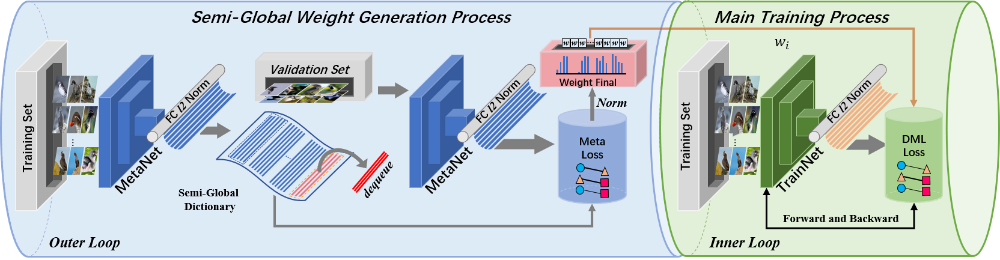

## Deep Metric Learning based on Meta-Mining Strategy with Semi-Global Information
This repository contains the official PyTorch implementation of the paper:**Deep Metric Learning based on Meta-Mining Strategy with Semi-Global Information**


Introduction
---
We propose a new metric learning method, Meta-Mining strategy with Semi-global Information (MMSI). 
It applies meta-learning to adaptively mine the samples in a 'soft' weighting strategy. And our method can work as a plug-and-play module to easily adapt to many existing metric learning methods. 
This repository contains datasets and source code to show the performance of our paper **Deep Metric Learning based on Meta-Mining Strategy with Semi-Global Information**

Framework
---
- **MMSI** framework contains two modules:

    - (1)  Semi-Global Weight Generation process(Outer Loop) 
    - (2) Main Training process(Inner Loop).



Requirements
---
   - For the ease of reproducibility, you are suggested to install [anaconda](https://www.anaconda.com/distribution/) before following executing the following commands. 
   
```bash
conda create -y -n mmsi python=3.7 (version>=3.5)
source activate mmsi
conda install -y pytorch cudatoolkit=10.1 -c pytorch
```
   - The batch-size=80 assumes your have a graphics card with 15GB video memory,e,g Tesla V100, for MMSI training.You may reduce the batch size if you have less video memory.


How to use
---
The code is currently tested only on GPU.
- Data Preparation
  
    Download dataset and checkpoint into working directory and decompress them 
    
    **DataSets**
    - [Car-196](http://ai.stanford.edu/~jkrause/cars/car_devkit.tgz)
    - [CUB-200-2011](http://www.vision.caltech.edu/visipedia-data/CUB-200/images.tgz)
    - [Stanford-Online-Products](ftp://cs.stanford.edu/cs/cvgl/Stanford_Online_Products.zip)
    
    **Checkpoint and pretrained ImageNet model**
    
    You can download the checkpoints that MS loss functions get when training three datasets for Finetune.
    And you can also get a pretrained model of Imaegnet from this link.
    - [MSLoss ckp. [baidu pan. Secure Code: p33f]](https://pan.baidu.com/s/1baB6E8HCs_rSAiXAxvkzxQ) 
    - Put the downloaded checkpoint and ImageNet pretrained model into `/MMSI_v1/models` and modify your absolute path in `utils/model_load.py`, `utils/args.py`and backbone files `BN_Inception.py & BN_Inception_MetaAda.py`.

- Source Code Details
    
    - If you want to train the model using the source code, please follow the subsequent steps.
    
        - 1）Build a project document named `e.g.,MMSI`, and put our code in it.
        - 2）Download dataset of `Dataset`/`CUB_200_2011(Cars196,Products)` into the working directory as needed.
        - 3）Use the command `cd MMSI` to enter the MMSI project.
        - 4）Use the command `sh Run_MMSI_XXX.sh` to run examples.
        - 5）Description of these `.sh` files.
            - **Run_MMSI_Con.sh** &nbsp;&nbsp;&nbsp;&nbsp; **#Core Command** 
               - Complete training presentation by MMSI + Contrastive Loss and single Contrastive Loss on CUB200 and Cars-196
            - `Run_MMSI_MS.sh` 
               - Fine-tune presentation by MMSI + MS Loss and single MS Loss on CUB200 and Cars-196
            - `Run_MMSI_SOP.sh` 
               - Fine-tune presentation SOP
            - For the above `Run_MMSI_X.sh`
              - modify `CUDA_VISIBLE_DEVICES` to proper cuda device id.
              - modify `MMSI` to control MMSI the on and off with `1` and `0`.
              - modify `DATA` to the desired dataset.


Code Structure
---

```bash
########################### Data ###########################
DataSet/                        # default folder for placing CUB-200-2011 Cars-196 and SOP datasets
    Cars|SOP|CUB200.py          # Load datasets and, where CUB200.py & transforms.py
                                  contains transformer for input images
####################### Evaluations ########################
evaluations/
    recall_at_k.py               # script for Recall@K(%) evaluation
    extract_featrure.py|cnn.py   # compute pairwise distance and extract features

########################### Loss ###########################
losses/

----------------- Contrastive Loss -----------------
     Contrastive.py              # original contrastive loss
    
     Contrastive_ini.py          # generate the gradient initial weight(Outer Loop)
     Global_Contrastive.py       # generate the gradient as raw weight(Outer Loop)
     Contrastive_W.py            # the loss in the inner loop participating in the training process

----------------- Multi-Similarity Loss -----------------
     MS.py                       # original Multi-Similarity loss

     MS_ini.py                   # generate the gradient initial weight(Outer Loop)
     Global_MS.py                # generate the gradient as raw weight(Outer Loop)
     MS_W.py                     # the loss in the inner loop participating in the training process

#################### Pretrain and Backbone ##################
models/
                                 
    # modify your pretrain model absolute path in backbone files
     BN_Inception.py             # routine training network
     BN_Inception_MetaAda.py     # outer loop network 
     meta_layers.py              # define the Meta-Net layer
     bn_inception-52deb4733.pth  # pre-trained on ImageNet
     Loss_Data_R@1.pth.tar       # checkpoint to finetune 

########################### Utils ###########################
                       misc functions
utils/ 
     args.py                     # set the default value of arguments
     ckptest.py                  # (1)test the effect of the pretraining model before training
                                 # (2)test the effect of the saved checkpoint during training
     model_load.py               # modify absolute path here
                                   
     HyperparamterDisplay.py     # print important parameters before training
     plot.py                     # use for drawing R@1 and loss variation diagrams
     sampler.py                  # contain K-P sampling function
     
########################### Train ###########################

--------------------- MMSI + DML Loss ----------------------

     MMSI_train.py               # script for training the neural network with MMSI framework (CUB200 Cars-196)
     MMSI_SOP_train.py           # script for training the neural network with MMSI framework (finetune SOP)
     trainer_MMSI.py             # MMSI FRAMEWORK
     trainer_MMSI_SOP.py         # MMSI FRAMEWORK

------------------------ DML  Loss -------------------------

     train.py                    # script for training the neural network
     trainer.py                  # traditional process for training the neural network

------------------------ Bash Script -------------------------
     Run_MMSI_Con.sh             # start the script for complete training process in contrastive loss
     Run_MMSI_MS.sh              # start the script for finetune training process in MS loss
     Run_MMSI_SOP.sh             # start the script for finetune training process in MS/contrastive loss on SOP

```


